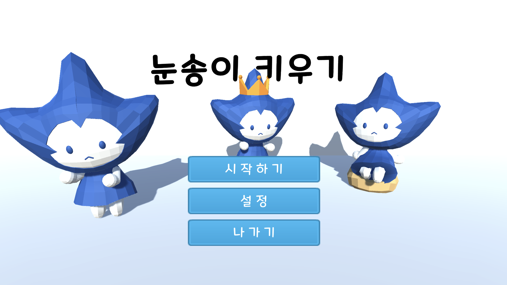
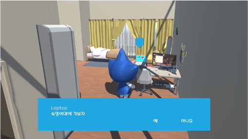
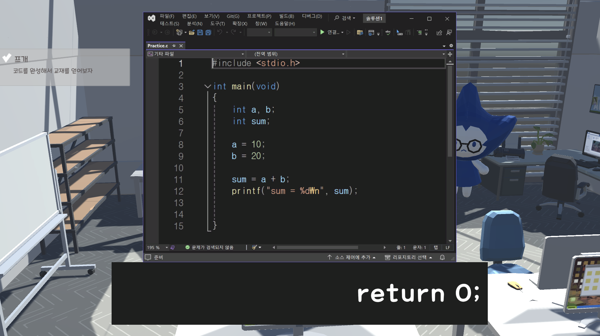
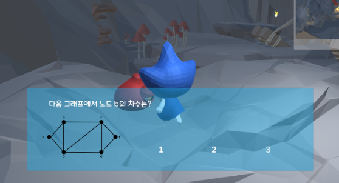
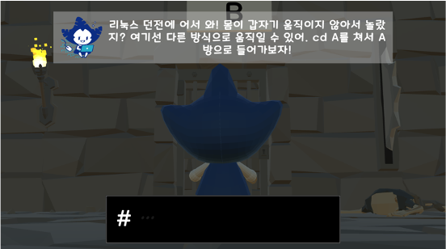
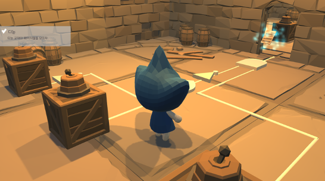

# 학과 소개 게임 <눈송이 키우기>

   
  
   

## 프로젝트 소개

무전공/자율전공 학생들에게 컴퓨터과학전공이 어떤 전공인지, 전공필수 과목에서 어떤 것을 배우는지 소개하는 게임

 

## 조작법
이동 - WASD
 
점프 - R
   
상호작용 - E
 
퀘스트창 열기 - Q
 
대화 넘기기 - SPACE
   

## 팀원 구성

|    권민지    |    김예린    |    최선호    |
| :---------: | :---------: | :---------: |
|  |  |  |

팀이메일 igeullu06@gmail.com
 
 

## 개발 환경
- 게임 엔진: Unity
- 개발 언어: C#
- 버전 관리: Github
- 협업 툴: Discord, Notion
 

## 게임 요약

### 퀘스트 받기

머리 위에 아이콘이 있는 NPC들에게 말을 걸어 스토리 및 퀘스트를 확인하세요!
   

### 프로그래밍개론

게임을 시작하는 첫 퀘스트로, 실습실에서 간단한 c언어 타이핑 게임을 해서 송이를 도와주세요! 준비된 코드가 한줄씩 나오며, 일치하는 단어를 입력하면 해당 단어가 사라집니다. 모든 문장을 입력하면 UI창이 닫히고 교재 아이템을 얻을 수 있습니다.
   

### 컴퓨터수학

모든 다리를 건너 스테이지를 클리어하세요! 한 붓 그리기 게임을 하듯 모든 다리를 통과하며 그래프에 대해 알아볼 수 있습니다.  
   

### 리눅스시스템

리눅스 명령어를 타이핑하며 수상한 던전을 탈출해보세요! inputfield에 일치하는 명령어가 들어오면 해당 명령어에 따라 플레이어를 이동시킵니다.
   

### 디지털논리회로

not, or, and 등의 게이트에 대해 배우고 복잡한 논리 회로를 풀어 방을 탈출하세요! 방에 있는 레버를 작동시켜 논리 회로의 값을 참으로 만들면 문이 열립니다.
   

## 개발 기간
2024.01 ~ 2024.03

 

